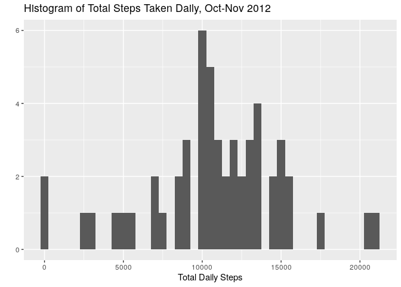
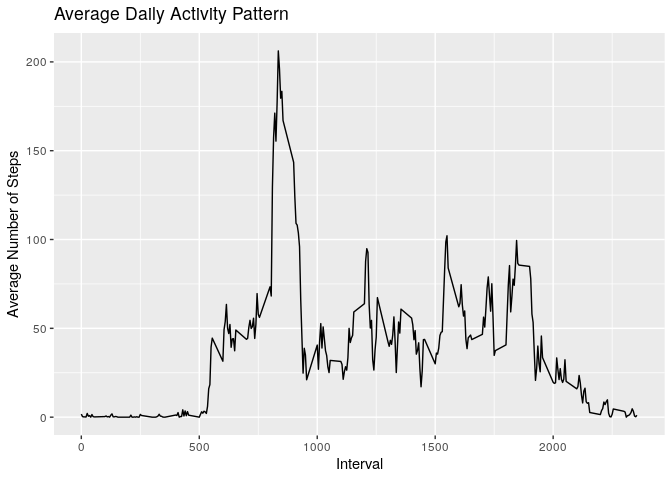
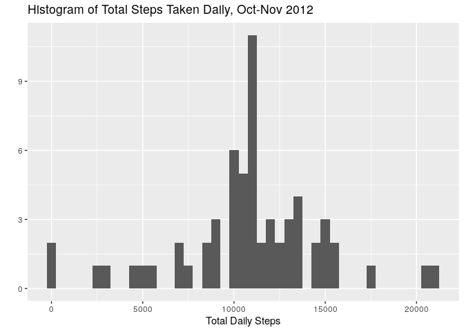
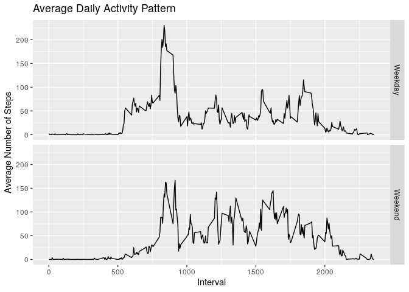

## Loading and preprocessing the data

The first step is to load the data and required libraries.
This code assumes the *activity.csv* file is in the current
working directory. The data is assigned to a data frame called
**step.data**.


```r
library(lubridate, warn.conflicts = FALSE)
library(dplyr, warn.conflicts = FALSE)
library(ggplot2, warn.conflicts = FALSE)
fname <- "activity.csv"
step.data <- read.csv(fname)
```

To preprocess this data, we will coerce **step.data$date** to
the Date class and create a second data frame called
**step.data.nona** with the NA data removed.


```r
step.data <- mutate(step.data, date = ymd(date))
step.data.nona <- step.data[!is.na(step.data$steps),]
```

## What is mean total number of steps taken per day?

To begin understanding the data, we will calculate the total number
of steps taken each day and view the results in a histogram. This
section ignores the NAs contained in the original data set.


```r
daily.steps <- with(step.data.nona,tapply(steps, date, sum))
steps.mean <- mean(daily.steps)
steps.median <- median(daily.steps)
qplot(daily.steps,binwidth=500,
      xlab="Total Daily Steps",
      main="Histogram of Total Steps Taken Daily, Oct-Nov 2012")
```

<!-- -->

The histogram shows that the total number of steps taken on most 
days is between 10,000 and 15,000. The mean number of steps per 
day is 10766.19 and the median number of 
steps per day is 10765.

## What is the average daily activity pattern?

Next, we characterize the average daily activity pattern by 
plotting the average number of steps taken in each measured 
interval.


```r
interval.mean <- with(step.data.nona,tapply(steps, interval, mean))
max.interval <- as.numeric(names(which.max(interval.mean)))
qplot(as.numeric(names(interval.mean)),interval.mean,
      geom="line",
      xlab = "Interval",
      ylab = "Average Number of Steps",
      main = "Average Daily Activity Pattern")
```

<!-- -->

The maximum average number of steps is
206.1698 and 
occurs in interval 835.

## Imputing missing values

Now, we will consider the impact of NAs in the original data set.


```r
na.count <- sum(is.na(step.data$steps))
na.pct <- mean(is.na(step.data$steps))*100
```

The original data set contained 2304 NAs. This represents
13.11475% of the data.

Due to the large amount of missing data, we will impute the original
data set by replacing NAs with the mean of the interval containing
the NA.


```r
step.data.imputed <- step.data
step.data.imputed$interval.mean <- rep(interval.mean,61)
step.data.imputed$steps[is.na(step.data.imputed$steps)] <-
  step.data.imputed$interval.mean[is.na(step.data.imputed$steps)]
```

We will now plot a histogram of the total number of steps each
day and recalculate the daily mean and median using the imputed
data set.


```r
daily.steps.imputed <- with(step.data.imputed,tapply(steps, date, sum))
steps.mean.imputed <- mean(daily.steps.imputed)
steps.median.imputed <- median(daily.steps.imputed)
qplot(daily.steps.imputed,binwidth=500,
      xlab="Total Daily Steps",
      main="Histogram of Total Steps Taken Daily, Oct-Nov 2012")
```

<!-- -->

The imputed histogram has roughly the same shape as the original and
shows that the total number of steps taken on most days continues to
be between 10,000 and 15,000. However, a new spike emerged near 
12,000. The change in the mean and median is negligible. The 
imputed mean number of steps per day is
10766.19 and the imputed median
number of steps per day is
10766.19.

Looking closer at the data set, it is missing data for eight
complete days. Replacing each NA with the mean for that interval
only reproduced eight average days resulting in no change to the
mean or median. The only effect is to reinforce the number of
days that express the average in the histogram.

## Are there differences in activity patterns between weekdays and weekends?

Finally, we will look at the variation across days of the week.


```r
step.data.weekday <- subset(step.data.imputed,
                            weekdays(step.data.imputed$date) %in%
                            list("Monday","Tuesday","Wednesday",
                                 "Thursday","Friday"))
weekday.mean <- with(step.data.weekday,tapply(steps,interval,mean))
weekday.df <- data.frame(steps = weekday.mean,
                         interval = as.numeric(names(weekday.mean)),
                         day.type = as.factor(rep("Weekday",288)))

step.data.weekend <- subset(step.data.imputed,
                            weekdays(step.data.imputed$date) %in%
                            list("Saturday","Sunday"))
weekend.mean <- with(step.data.weekend,tapply(steps,interval,mean))
weekend.df <- data.frame(steps = weekend.mean,
                         interval = as.numeric(names(weekend.mean)),
                         day.type = as.factor(rep("Weekend",288)))

interval.day.mean <- rbind(weekday.df,weekend.df)

qplot(interval,steps,data=interval.day.mean,
      geom = "line", facets = day.type~.,
      xlab = "Interval",
      ylab = "Average Number of Steps",
      main = "Average Daily Activity Pattern")
```

<!-- -->

This series of plots shows that the weekend steps start later in the day and are slightly higher throughout much of the day.
